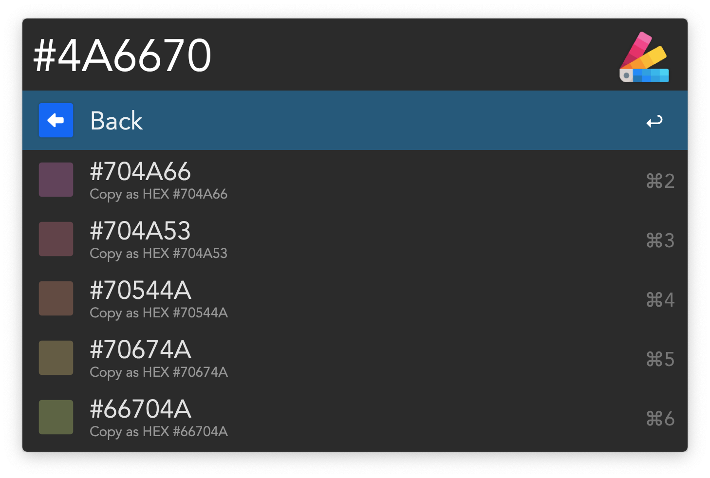

# Alfred Color Picker

Quickly browse, convert, and generate color palettes directly from Alfred.  

## Features

- Brand Colors  
- Analogous Colors Palette  
- Complementary Colors Palette  
- Color Shades Palette   
- Color Conversion  
- Clipboard Manager Universal Actions 

## Usage

Type `cp` in Alfred to launch the Color Picker menu.  

Pick one of the Color Picker menu options:

- `Brand Colors` - Display a configurable list of brand colors from a workflow environment variable.  
- `Analogous Colors <hex>` - Generate a 5-color analogous palette from a HEX input.  
- `Complementary Colors <hex>` - Generate a 5-color complementary palette from a HEX input.  
- `Color Shades <hex>` - Generate a range of lightness shades from a HEX input.   
- `Convert Color <hex>` - Convert a HEX color to HEX, RGB, rgb(), HSL, and hsl() formats, ready to copy.
- **Universal Actions** — Select any color from the Alfred Clipboard Manager and launch it directly into Analogous Colors, Complementary Colors, Color Shades, or Convert Color — no typing required.

## Notes

Color results support configurable modifier keys for copying alternate formats. The default bindings are:

<kbd>↩</kbd>: Copy as HEX (e.g. `#FF0080`)  
<kbd>⌘</kbd> <kbd>↩</kbd>: Copy as RGB (e.g. `255, 0, 128`)  
<kbd>⇧</kbd> <kbd>↩</kbd>: Copy as CSS rgb() (e.g. `rgb(255 0 128)`)  
<kbd>⌥</kbd> <kbd>↩</kbd>: Copy as HSL (e.g. `214, 100, 50`)  
<kbd>⌃</kbd> <kbd>↩</kbd>: Copy as CSS hsl() (e.g. `hsl(214 100% 50%)`)

> This project was built to test the usability of the [`alfred-results`](https://github.com/joshbduncan/alfred-results) Python package, which provides a typed interface for constructing Alfred Script Filter JSON payloads.